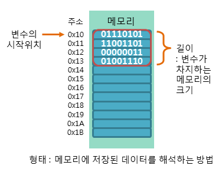

# 01 데이터 타입
> Javascript 에서는 데이터 타입에 따라서 메모리에 저장된 데이터를 조금 다른 방식으로 다룹니다. 데이터를 메모리에 저장하는 과정을 공부하고, 데이터 타입별로 차이점 확인하여 `Mutable`, `Immutable` 에 대해 알아봅니다.

## 0. 메모리 (Memory)

메모리란 내 코드가 실행될 때 내가 선언한 변수, 함수, 실행문들이 저장되는 어느 곳입니다. 실제 메모리를 눈으로 먼저 보면 아래와 같이 생겼습니다.


물리적으로는 이렇게 구성된 메모리를 들여다보면 이 공간을 서로 구분하기 위해서 각 공간마다 <span style="color: green">**주소**</span>를 부여합니다. 이를 메모리 주소라고 부르고, 해당 공간을 알아내기 위한 식별자라고 이해할 수 있습니다.

우리가 흔히 **숫자 3이라는 데이터를 저장한다** 라고 표현하면, 특정 **메모리 주소를 가진 어느 공간에 3이라는 데이터를 저장하고, 3이 저장된 주소를 다른 곳에서 활용**하게 됩니다.

자바스크립트에서 숫자를 저장할 때, 문자열을 저장할 때, 객체를 저장할 때, 모두 동일한 구조의 공간에 저장합니다. 이를 활용하는 방법은 데이터 타입에 따라 조금씩 다릅니다.



위 그림을 보면 하나의 메모리 공간에는 8개의 숫자 (0 or 1)가 저장될 수 있습니다. 변수를 저장하면, 해당 변수가 가진 데이터의 크기에 따라 특정 크기의 메모리를 사용하게 되고, 준비되어 있던 모든 메모리 공간에 데이터가 차면, 해당 메모리는 더이상 사용할 수 없게 됩니다.

## 1. 변수 선언과 데이터 할당
변수를 선언하는 것과 할당하는 것. 두 과정을 메모리 측면에서 생각해보겠습니다. 
### 📍 선언
우선 텅 빈 메모리가 있습니다. 여기서 변수 `a` 을 선언하면, 텅 빈 메모리에 `a` 이라는 이름으로 저장될 어떠한 데이터를 위해 공간을 잡아둡니다.
```js
var a;
```

|주소|...|1002|1003|1004|1005|...|
|---|---|---|---|---|---|---|
|데이터|||이름 : `a` <br /> 값 :||||

데이터를 선언만 했을 뿐 할당하지 않았으므로, 값은 비어있습니다. 이후에 누군가 `a`변수에 접근한다면, 컴퓨터는 메모리에서 이름이 `a`인 메모리 주소를 찾아서, 해당 공간에 저장되어 있는 데이터를 반환할 것입니다. 현재는 비어있기 때문에 아무것도 반환하지 않습니다. 정확히는 `undefined`를 반환합니다.

### 📍 할당
선언 이후, 미리 확보된 메모리 주소의 공간에다 특정한 데이터를 저장하는 것을 보고 말합니다.
```js
var a;
a = 'hello';
```
위와 같은 할당 과정을 거치고 나면, 우리의 메모리는 다음과 같은 상태로 변경된다고 생각하기 쉽습니다.
|주소|...|1002|1003|1004|1005|...|
|---|---|---|---|---|---|---|
|데이터|||이름 : `a` <br /> 값 : `hello`||||

그러나 현실은 늘 생각을 빗나가고, 실제로는 아래와 같은 형태로 구성됩니다.
|주소|...|1002|1003|1004|1005|...|
|---|---|---|---|---|---|---|
|데이터|||이름 : `a` <br /> 값 : `@5003`||||

<br>

|주소|...|5002|5003|5004|5005|...|
|---|---|---|---|---|---|---|
|데이터|||`hello`||||

<br>

실제 데이터 `hello`는 `a`라는 변수명과는 다른 별도의 메모리 공간에 저장을 하고, `hello`가 저장된 메모리 주소 `5003`을 변수 `a`의 값으로 알려주는 것입니다.

> 변수 `a`를 선언하면서 확보해둔 공간에 직접 데이터를 저장하지 않고 절차를 하나 더 거치는 이유는 메모리 용량을 가변적으로 사용하여 데이터를 수정해야할 때 더 많은 연산을 하지 않기 위해서
이며, 같은 데이터를 중복으로 여러번 저장하지 않고 한 번 사용했던 메모리를 여러 변수가 공유할 수 있게 하기 위해서입니다.

이 상황에서 `a`에 할당된 값을 `hello`가 아닌 `hello world`로 변경한다면 어떤 과정이 일어날까요? 
```js
var a = 'hello';
a = a + ' world'
```
변수 `a`가 메모리주소 `5003`을 참조하고 있으니 메모리 주소 `5003`에 저장된 값이 `hello`에서 `hello world`로 바뀌는 것일까요? 그렇지는 않습니다. 메모리 주소 `5003`에 저장된 값은 `hello`로 계속 유지됩니다. 대신, 새로운 메모리 주소 `5004`에 `hello world`라는 <span style="color: green">**새로운**</span> 데이터가 저장되고, 변수 `a`가 바라보는 메모리 주소가 `5003`에서 `5004`로 바뀌게 됩니다.
|주소|...|1002|1003|1004|1005|...|
|--- |---|--- |--- |--- |--- |---|
|데이터|||이름 : `a` <br /> 값 : `@5004`||||

<br>

|주소|...|5002|5003|5004|5005|...|
|---|---|---|---|---|---|---|
|데이터|||`hello`|`hello world`|||

이처럼, 새로운 문자열이 추가되든, 문자열을 지우든 상관없이, 다른 값을 할당한다면 완전히 새로운 메모리 주소에 새로운 값을 저장하고, 새로 할당된 메모리 주소를 변수가 바라보게 됩니다.

비효율적으로 보일 수 있지만, 큰 장점이 있습니다. `hello world`라는 데이터를 저장하고 있는 변수가 `a` 하나 뿐인 것이 아니라 `b`, `c`, `d`,....`fffff` 까지 수십, 수백여개 있다면 어떨까요? `hello world`를 수백번 저장하는 대신, 그 모든 변수가 `hello world`의 메모리 주소인 `5004`만 저장하고 있으면 되는 것입니다. 훨씬 재사용하기 수월해졌습니다.

> 그렇다면 지금 아무도 참조하고 있지 않은 메모리 주소인 `5003`번에 저장된 `hello`는 언제까지고 계속 살아있을까요? 그렇지 않습니다. 자바스크립트 내부의 가비지 컬렉터(grabage collector)라고 하는 장치가, 참조되고 있는 변수가 하나도 없는 데이터는 자동으로 제거하기 때문입니다.

변수의 선언과 할당은 메모리 상에서 이러한 과정을 통해서 이루어집니다.

## 2. 기본형 데이터 vs 참조형 데이터
기본형 데이터와 참조형 데이터를 구분하는 기준은 `불변성 여부`입니다. 여기서 `불변성`은 무엇일까요? 무엇이 변하지 않는다는 말일까요? 반대 단어인 `가변성`은 무엇이 변한다는 말일까요? 답은 변수에 할당된 `값`이 가지는 메모리 주소에 저장되어 있는 데이터입니다. 어떤 데이터가 불변값이고, 어떤 데이터가 가변값인지 알아보도록 하겠습니다.

### 📍 불변값
기본형 데이터인 `숫자, 문자열, boolean, null, undefined, Symbol`은 모두 불변값입니다. 한 번 메모리 주소에 데이터가 저장되면, 그 데이터가 변경되지 않는 다는 뜻입니다. 앞서 살펴본 예시에서, `a`에 할당된 데이터를 `hello`에서 `hello world`로 변경했을 때, 메모리 주소 `5003`에 저장되어 있던 데이터 `hello`가 `hello world`로 변경된 것이 아니었습니다. `5003`에 저장된 `hello`를 `hello world`로는 **절대로 변경할 수 없습니다.** 변수에 할당된 불변값을 변경하는 것은 오로지 새로운 데이터를 생성하는 과정을 통해서만 이루어집니다. 이것이 바로 불변값의 성질입니다. 
> 한 번 만들어진 불변값은 가비지 컬렉팅을 당하지 않는 한 영원히 변하지 않습니다. 이러한 불변성을 가지는 데이터 타입을 기본형 데이터 타입이라고 합니다.

### 📍 가변값
참조형 데이터는 가변값으로, 메모리에 한 번 저장된 데이터를 변경할 수 있다는 의미로 해석하기 쉽지만, 그렇지는 않습니다. Javascript 참조형 데이터의 대표적인 예시인 객체를 변수에 할당하는 과정을 보자면 아래와 같습니다.
```js
var obj1 = {
    a: 100,
    b: 'byebye'
}
```
책에서 설명하는 과정을 인용하자면, 아래와 같은 일련의 절차가 진행됩니다.

<div background-color: grey; display: inline-block>

1. 컴퓨터는 변수 영역의 빈 공간(@1002)을 확보하고, 그 주소의 이름을 obj1으로 지정합니다.
2. 임의의 데이터 저장 공간(@5001)에 데이터를 저장하려고 보니, 여러 개의 프로퍼티로 이뤄진 데이터 그룹입니다. 이 그룹 내부의 프로퍼티들을 저장하기 위해 별도의 변수를 마련하고, 해당 변수의 주소(@7103~?)를 @5001에 저장합니다.
3. @7103 및 @7104에 각각 a와 b라는 프로퍼티 이름을 지정합니다.
4. 데이터 가운데 숫자 1을 검색합니다. 검색 결과가 없으므로 임의로 @5003에 젖아하고, 이 주소를 @7103에 저장합니다. 문자열 'byebye' 역시 임의로 @5004에 저장하고, 이 주소를 @7104에 저장합니다.

</div>

|주소|...|1002|1003|1004|1005|...|
|--- |---|--- |--- |--- |--- |---|
|데이터|||이름 : `obj1` <br /> 값 : `@5001`||||

<br>

|주소|...|5001|5002|5003|5004|5005|...|
|---|---|---|---|---|---|---|---|
|데이터||`@7103~?`||`100`|`byebye`|||

<br>

|주소|7103|7104|7105|7106|...|
|---|---|---|---|---|---|
|데이터|이름 : `a` <br /> 값: `@5003`|이름 : `b` <br /> 값: `@5004`||||

기본형 데이터와 크게 다른 점은 없습니다. 객체에서 `key`에 해당하는 부분이 별도로 다시 변수와 같은 역할을 해서 메모리에 `이름`을 갖는 다는 점. `key`의 메모리가 다시 참조하고 있는 다른 메모리 주소가 있다는 점. 이 두가지를 이해하는 것이 중요합니다.

다른 데이터가 저장된 메모리 주소를 참조한다는 점만 빼면, 저장된 데이터 자체 (`100`, `byebye`)는 모두 불변값입니다. 
### 📍 가변값 변경
어떠한 메모리 주소에 저장된 불변값은 절대 변경할 수가 없다고 했는데, 그렇다면 메모리에 저장된 가변값은 변경할 수 있는 것일까요? 앞서 생성한 객체를 변경해보겠습니다.
```js
obj1.a = 200;
```
`obj1`의 `a` 속성에 숫자 `200`을 할당하려면, 우선 `200`이라는 데이터가 저장된 메모리 주소가 있는지 확인 후, 없다면 새로운 공간인 `@5005`에 `200`을 저장하고, `@5005`라는 주소를 `a`가 참조할 수 있도록 지정해주어야 합니다. `@7103`주소에 `@5005`를 저장해줍니다.

|주소|...|1002|1003|1004|1005|...|
|--- |---|--- |--- |--- |--- |---|
|데이터|||이름 : `obj1` <br /> 값 : `@5001`||||

<br>

|주소|...|5001|5002|5003|5004|5005|...|
|---|---|---|---|---|---|---|---|
|데이터||`@7103~?`||`100`|`byebye`|**<span style="color: blue">200</span>**||

<br>

|주소|7103|7104|7105|7106|...|
|---|---|---|---|---|---|
|데이터|이름 : `a` <br /> 값: **<span style="color: blue">@5005</span>**|이름 : `b` <br /> 값: `@5004`||||

<br>

> 변수 `obj1`의 입장에서는 변수가 바라보고 있는 메모리 주소가 `@5001`로 바뀌지 않았습니다. 이전에 `새로운` 데이터 `hello world`가 생긴 것과는 달리 `새로운 객체` 가 만들어진 것은 아닙니다. 그러나 같은 메모리 주소를 참조하는 상태를 유지하면서도 객체 내부의 `key`가 가리키는 값이 달라졌습니다. 이와 같은 특징 때문에 객체, array 와 같은 데이터 타입은 가변값이라고 부릅니다.

## 3. 변수 복사
메모리 상에서 변수가 어떻게 이용되는 지를 알고나면, 변수가 복사된다는 개념도 메모리와 연관지어 생각할 수 있습니다.
```js
var a = 'happy';
var b = a;

var obj1 = { c: 'happy', d: 1000 };
var obj2 = obj1

b = 'sad';
obj2.c = 'really happy';
```
기본적으로 `변수를 복사한다` 라고 하면 사실, 그 변수를 이름으로 갖고 있는 데이터가 위치한 메모리 주소를 복사하는 것과 같습니다. 

|주소|...|1001|1002|1003|1004|1005|...|
|--- |----|---|--- |--- |--- |--- |---|
|데이터||이름 : `a` <br/> 값: `@5001`|이름 : `b` <br/> 값: `@5001`|이름 : `obj1` <br /> 값 : `@5002`|이름 : `obj2` <br /> 값 : `@5002`|||

<br>

|주소|...|5001|5002|5003|5004|5005|...|
|---|---|---|---|---|---|---|---|
|데이터||`happy`|`@7103~`|`1000`||||

<br>

|주소|...|7103|7104|7105|7106|...|
|---|---|---|---|---|---|---|
|데이터||이름 : `c` <br /> 값: `@5001`|이름 : `d` <br /> 값: `@5003`||||

### 📍 불변값 복사
`a`를 복사한 `b`를 만들었습니다.
이렇게 이름이 `a`인 변수와 이름이 `b`인 변수가 서로 동일한 메모리 주소를 바라보게 됩니다. 이 상태에서 `b`의 값이 `sad`로 변경되었습니다. javascript는 새로운 메모리 `@5004`에 `sad`라는 데이터를 저장하고, `@5004`를 변수 `b`의 값으로 저장합니다. `a`와 `b`가 이제는 더이상 서로 같은 주소를 바라보지 않습니다.


### 📍 가변값 복사
`obj2`의 프로퍼티 `c`의 값이 변경될 때는 어떨까요? `c`라는 변수가 가진 데이터가 `happy`에서 `really happy`로 변경됐습니다. 이는 `really happy`라는 데이터가 새로운 메모리인 `@5005`에 저장되고, 변수 `c`가 가리키는 메모리 주소가 `@5001` 에서 새로 생성된 `@5005`로 변경되었다는 뜻입니다. 그러나 `obj2`가 가리키고 있는 메모리 주소 `@5002`가 다른 메모리 주소로 변경된 것은 아닙니다.

가변값 복사의 이름답게, 변수가 가리키는 대상은 바뀌지 않았지만, 해당 객체 내부에 종속되어있던 프로퍼티가 가리키는 주소는 바뀌었습니다. `새로운 객체`는 한 번도 생성된 적이 없습니다.

이렇게되면, 메모리 입장에서는, `obj1`과 `obj2`는 항상 같은 메모리에 저장된 데이터를 바라보게 됩니다. `obj2`를 `obj1`과 완전히 다른 객체를 바라보게끔 하고싶다면 어떻게 해야할까요?
```js
var obj2 = {
    c: 'really happy',
    d: 1000
}
```
이렇게 완전히 새로 할당하는 방법을 통해 `obj1`과 `obj2`를 분리시킬 수 있습니다.

## 4. 얕은 복사와 깊은 복사
정의 부터 언급하자면, 얕은 복사는 눈에 보이는 바로 아래 단계의 값만 복사하는 방법입니다. 해당 변수가 중첩 객체라던가, 중첩 array라면 내부 값의 메모리 주소는 복사되지 않고 변수 자체만 복사됩니다. 깊은 복사는 내부의 모든 값들을 *하나하나* 다 복사하는 방법입니다. 이 말은 중첩된 객체에서 참조형 데이터가 저장된 프로퍼티를 복사하면, 해당 주소값만 복사되는 것이 아니라 온전히 다른 새로운 객체가 생성되고 그 메모리 주소를 새로운 변수에 할당하는 과정이라는 뜻입니다.

당연히, 복사된 대상의 데이터를 변경해도 원본 변수는 지장을 받지 않습니다.

> 기본형 데이터일 경우에는 그대로 완전히 복사되지만, 참조형 데이터는 다시 그 내부의 프로퍼티까지 복사해야 독립된 두번째 변수를 얻을 수 있습니다.


## 5. 마무리
변수는 변경 가능한 데이터가 담길 수 있는 공간입니다. 변수를 선언한다는 것은 컴퓨터 메모리에 변수를 위한 공간을 확보한다는 의미가 되며, 확보된 위치에 우리는 데이터를 저장할 수 있습니다. 자바스크립트에서 특정한 변수를 호출한다는 것은 해당 변수가 가리키고 있는 메모리 주소에 저장된 데이터를 반환한다는 것과 같은 의미입니다. 변수와 메모리 관계를 잘 이해하고, 변수 호출, 변수 변경, 변수 복사를 진행 할 때 내가 원하는 데이터가 잘 반환되고 있는 과정이 맞는지 생각하며 사용하는 것이 중요합니다.